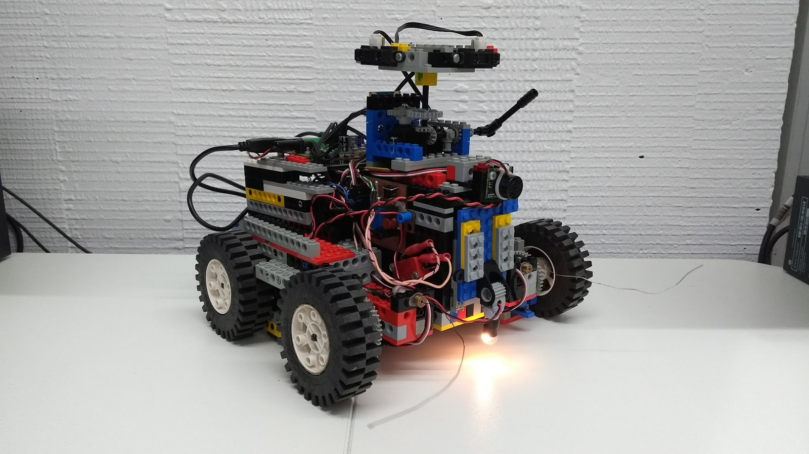
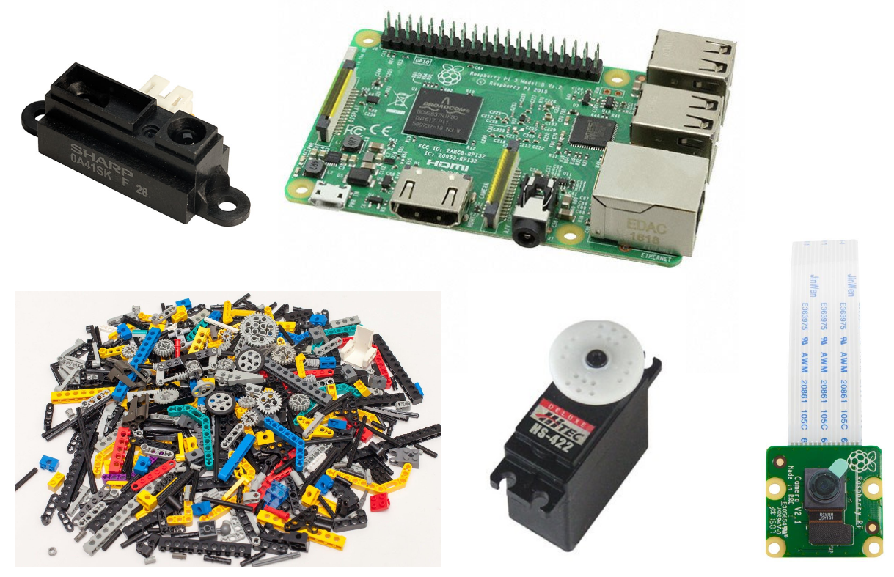
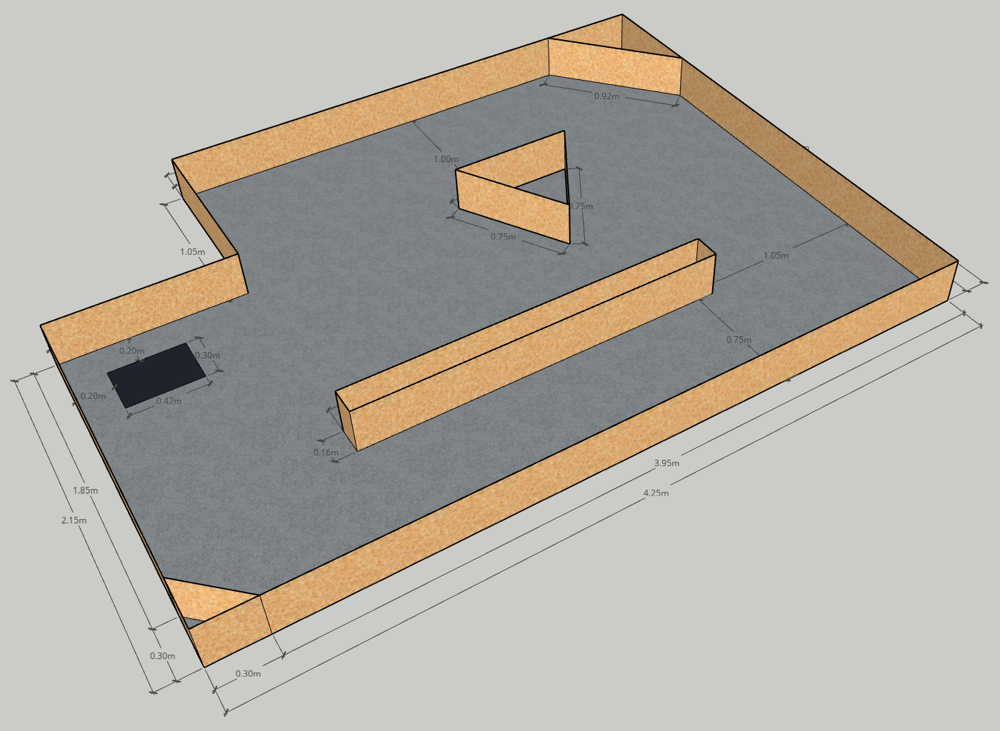
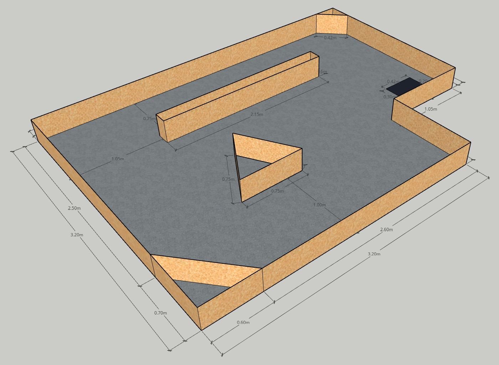
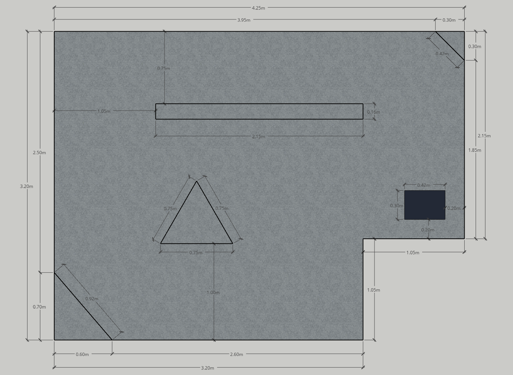
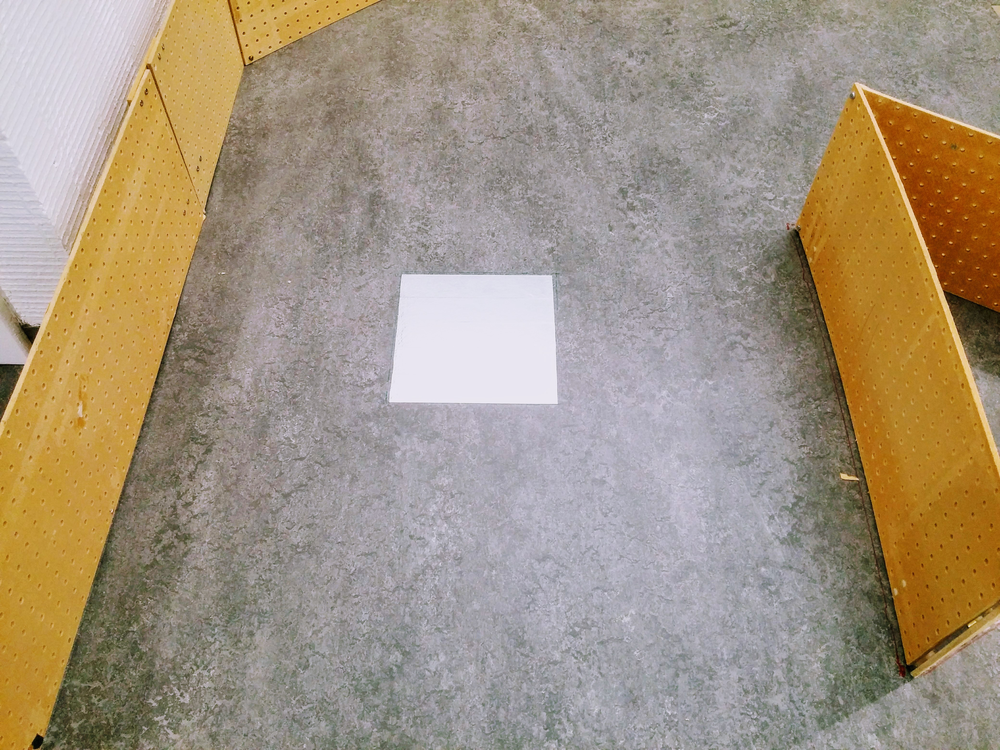
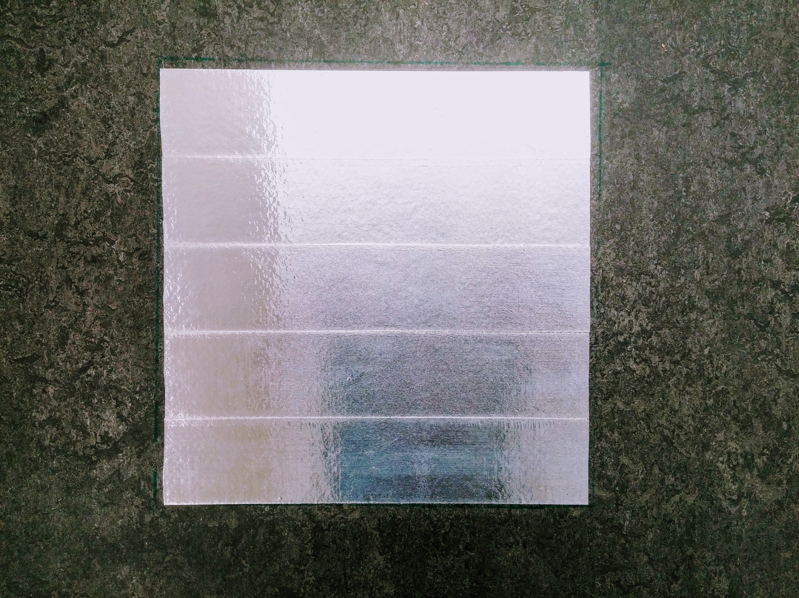
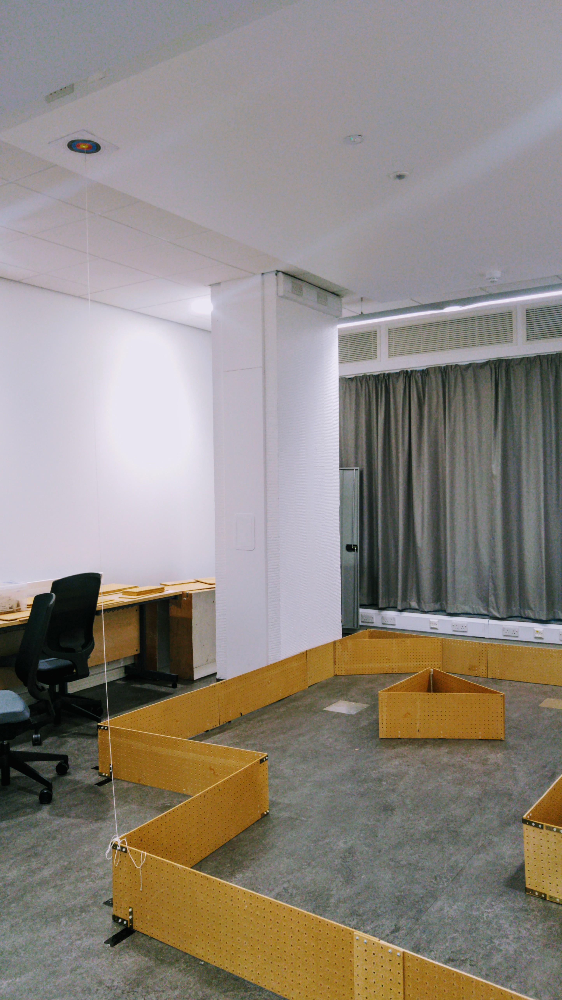
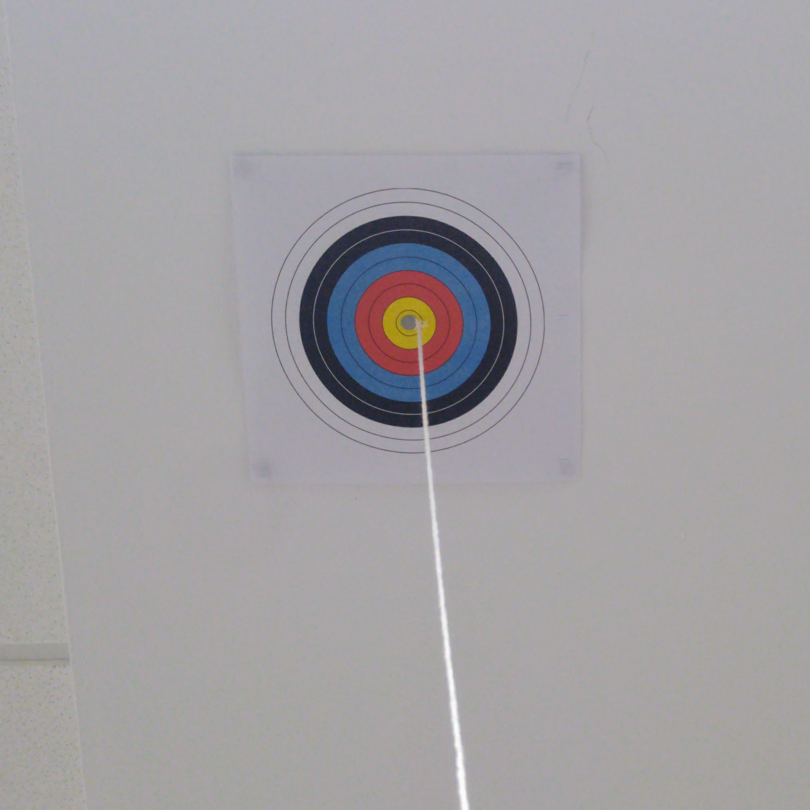

## Learning Outcomes

- Rapid prototyping of robot hardware and software.
- Implementation of control and planning techniques for navigation.
- Implementation of inverse kinematics.
- Implementation of localization techniques.
- Apprehend real-world constraints and issues.
- Scientific report writing.

## Desired Skills

- Programming in Python.
- Knowing other programming languages is an advantage.
- Introduction to Python will be provided in a tutorial.
- Optional: computer vision with the OpenCV library.
- Mechanical engineering training or experience.
- We will provide basic introduction.
- Version control, e.g. git.

## The Task

A remote location has to be autonomously inspected by a robot. 
The collected data has to be then sent to the base station. 
Since the base station is too far away, a satellite link has to be established to successfully transfer the data. 
To do this, the robot has to point its antenna towards the satellite in orbit. 
The location of the satellite is known and the area has been previously mapped.

Your task is to build and program a robot that can:
- Navigate around the arena autonomously.
- Locate Points of Interest (POI) to be inspected (these will be marked on the floor by a reflective tape).
- Use localization to compute the position and orientation relative to the communication satellite.
- Align the antenna to point towards the satellite.
- Return back to the deployment location.

The robot will start in a known deployment location. 
The deployment location will be marked by a black patch on the floor. 
The arena will contain several obstacles and walls dividing it into zones. 
Some of the zones will contain POIs. 
Each POI will be marked by a reflective tape on the floor. 
When the robot locates the POI, it has to establish a communication link with the base station. 
To do this, is has to point its antenna towards a virtual satellite. 
You will have to implement Inverse Kinematics (IK) and use the main driving controls together with the provided servomotor to align the antenna. 
The satellite will be a fixed point on the ceiling. 
The location of the satellite relative to the arena will be given to you. 
The shape of the arena will also be provided. 
You may use this to build a map for localization. 
At the end of the task, the robot returns back to the deployment location (this is known as homing).
The final goal of this practical is to inspect 3 POIs and transfer the data after each POI has been visited before returning back to the deployment location. 

## Technical Expected Work

- Design and build the robot:  
Wheel architecture, mass distribution, sensor placement, gear transmission, ...
- Motors control: forward and turning motion.
- Sensors reading and filtering.
- Odometry estimation.
- Obstacle avoidance.
- Exploration navigation to find POI.
- Localization estimation.
- (optional) Use camera for additional information.

**Integration and robustness**

## The Arena

Click any of the images below to open the original image in a new tab.

## The POIs

The Points of Interest (POIs) are made out of reflective tape. They are approximately 25cm x 25cm.

## The Satellite

The satellite is represented by a bullseye on the ceiling of the lab. 
There is a string coming from its centre which you can pull **gently** to check your antenna alignment.

