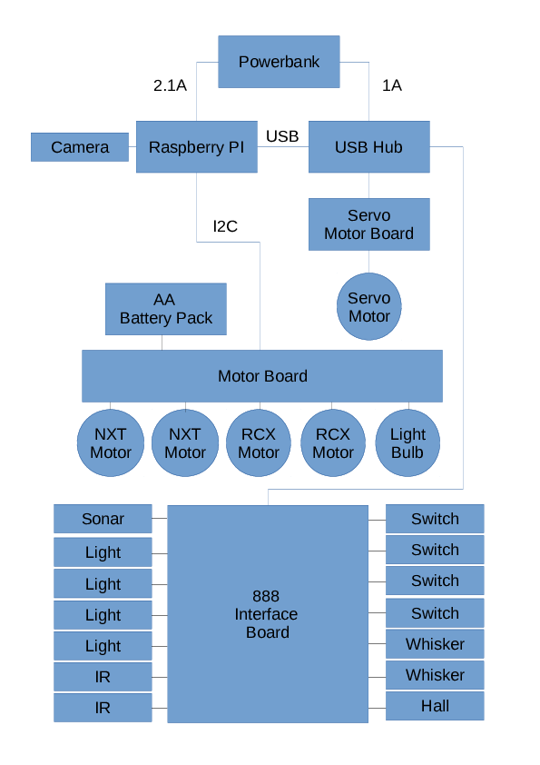
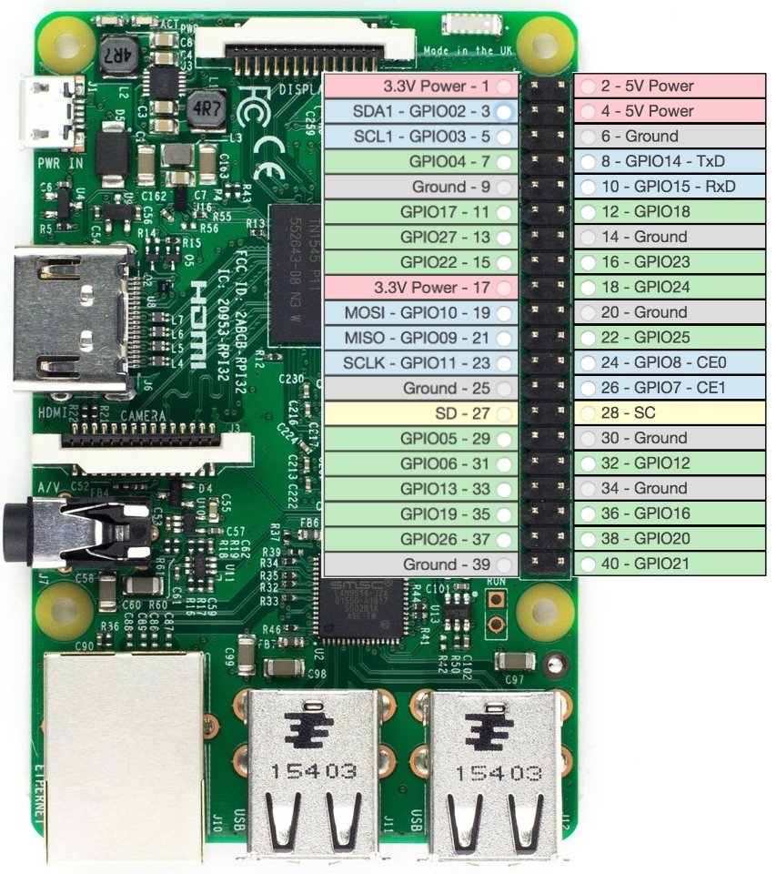

## Hardware Architecture Diagram

## Hardware Wiring

## To get Started With Python/Linux

- Python: Codecademy - <https://www.codecademy.com/learn/learn-python>
- Linux Command Line: <https://www.codecademy.com/learn/learn-the-command-line>
- Gearing: 
    - Lego Gears: <http://sariel.pl/2009/09/gears-tutorial/>
    - Gear Ratios: <https://www.wikihow.com/Determine-Gear-Ratio>

## Robot Building Essentials

Following links provide some basic tips and tricks when building robots using lego:
- Mechanical design (gears, bracing, ...): <http://www.cs.tufts.edu/comp/150IR/artoflego.pdf>
- Gear trains and bracing: <http://www.clear.rice.edu/elec201/Book/legos.html>
- Gear trains and wheels: <http://www.ecst.csuchico.edu/%7Ejuliano/csci224/Slides/03%20-%20Gears%20Pulleys%20Wheels%20Tires.pdf>
- Motor characteristics: <http://www.philohome.com/motors/motorcomp.htm>
- Tips and tricks: <http://homepages.inf.ed.ac.uk/gde/work/sdp/Robot_Construction_Guide.odt>
- Gear ratio calculator: <http://gears.sariel.pl>

## Arena 3d model

Click the preview below to enable the 3D WebGL viewer.
When the 3D viewer has loaded, the world frame axes will be displayed: X-Y-Z are red, green, and blue, respectively.
Regarding orientation, we will measure angles in degrees and with respect to the X-axis (theta, θ = 0°).
This means that a robot looking towards the windows of the lab next to the arena will have θ = 90°.

<iframe src="https://3dwarehouse.sketchup.com/embed.html?mid=9d75cb24-16f1-4da9-b015-7b155e7679ab&amp;width=870&amp;height=489" 
    marginwidth="0" marginheight="0" scrolling="no" width="870" height="489" frameborder="0">
</iframe>

## Raspberry Pi 3 Pinout

## Hardware list

- Raspberry Pi
- Raspberry Pi Lego Case
- Raspberry Pi Camera (in the Lego Case)
- 16GB MicroSD Card
- Power Bank (Do not charge and use at the same time!)
- USB Hub, Externally Powered
- Motor Board
- 16 x AA Rechargable Batteries
- 2 x 8 Way Battery Holders
- Battery Charger
- Battery Tester
- Power Lead (Battery Pack to Motor Board)
- I2C Lead
- 2 x USB Micro Lead
- 1 x USB Plugtop Adapter
- 2 x USB Mini Lead
- 1 x USB B Lead
- 1 x Phidget 888 Assembly
- 2 x NXT Motors
- 2 x RCX Motors
- 2 x Whisker Sensors
- 4 x Lego Leads
- 2 x Lego Legacy Leads
- 4 x Microswitches
- 2 x Infrared Sensors
- 4 x Light Sensors
- 1 x Sonar Sensor
- 1 x Hall Effect Sensor
- 1 x Servo Motor
- 1 x Light Bulb

